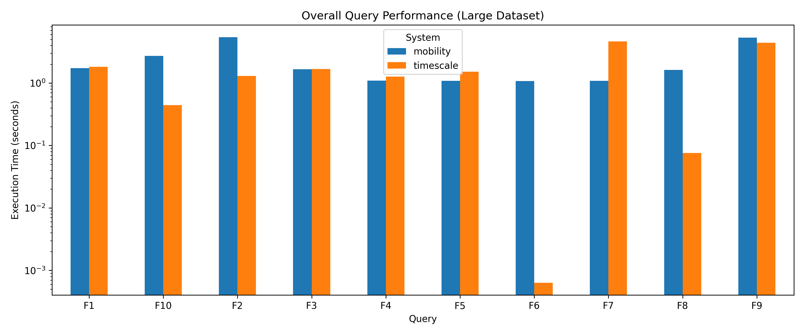
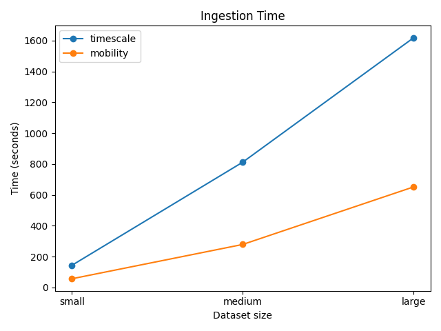
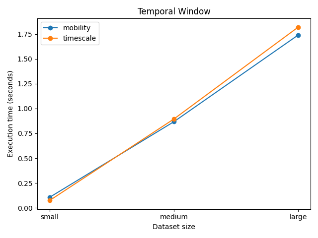

# tjsonb Benchmark

## What this benchmark measures

This repository contains the benchmark and evaluation framework used to
evaluate the proposed `tjsonb` temporal JSON representation implemented in
MobilityDB.

The benchmark compares two approaches for storing and querying temporal JSON
sensor data:
- a temporal object representation using `tjsonb` in MobilityDB,
- and a relational representation based on timestamped `jsonb`
  observations stored in TimescaleDB.

The evaluation focuses on:
- ingestion cost,
- query execution performance,
- storage footprint,
- indexing behavior,
- and query formulation complexity.

The workload includes common analytical operations over temporal sensor
trajectories, including temporal filtering, semantic threshold predicates,
grouped aggregation, temporal window analysis, endpoint retrieval, and
temporal statistics.

The evaluation uses the experimental `jsontypes` branch of MobilityDB,
including additional modifications by Prof. Esteban Zimányi related to
`pgtypes` integration:

-https://github.com/estebanzimanyi/MobilityDB/tree/jsontypes

The benchmark framework, workloads, indexing strategies, and plots were
developed as part of the evaluation presented in the accompanying master
thesis.

---

## Systems under evaluation

### MobilityDB + `tjsonb`

The first system uses the experimental `tjsonb` implementation integrated
into MobilityDB and MEOS.

In this model, each sensor is represented as a symbolic temporal object
describing the evolution of structured JSON state over time.

Instead of storing observations as independent rows, timestamped semantic
observations are grouped into compact temporal trajectories. Queries are
then expressed directly over temporal objects using temporal operators and
trajectory-oriented processing.

### TimescaleDB + relational `jsonb`

The second system uses a relational representation implemented with
TimescaleDB hypertables.

In this model, each timestamped sensor observation is stored as an
individual row containing:
- a sensor identifier,
- a timestamp,
- and a `jsonb` document storing semantic attributes.

Temporal semantics are reconstructed at query time using filtering,
aggregation, ordering, and grouping operations over relational rows.

### Compared representations

Both systems preserve the same sensor information and support equivalent
analytical workloads, but they differ fundamentally in how temporal semantic
data is represented internally.

The relational model focuses on fine-grained indexed access to individual
observations, while the `tjsonb` model emphasizes compact symbolic
representation and direct manipulation of structured temporal state
evolution.

## Benchmark workload

The benchmark workload was designed to evaluate common analytical operations
over temporal IoT trajectories.

The workload compares equivalent SQL queries executed on both systems over
the same datasets. Each query category targets a different aspect of
temporal analytical processing, including temporal filtering, semantic
predicates, aggregation, endpoint access, and window-based analysis.

All queries are located in:

```text
sql/queries/
```

Each query category contains:
- a MobilityDB implementation,
- and a relational TimescaleDB equivalent.

### Query categories

| ID | Category | Description |
|---|---|---|
| F1 | Temporal window | Retrieve observations within a temporal interval |
| F2 | Threshold filter | Filter trajectories using semantic attribute thresholds |
| F3 | Time + threshold filter | Combine temporal and semantic predicates |
| F4 | Count per sensor | Count observations or instants for each sensor |
| F5 | Duration | Compute temporal duration of trajectories |
| F6 | Global time range | Retrieve global temporal extent |
| F7 | Latest value | Retrieve latest value for each sensor |
| F8 | First value | Retrieve first value for each sensor |
| F9 | Average humidity | Aggregate semantic values over time |
| F10 | Window average temperature | Compute aggregation over restricted temporal windows |

The workload was intentionally designed to include both trajectory-oriented
operations and traditional relational analytical patterns.

This allows the evaluation to analyze how the `tjsonb` representation
behaves across different classes of temporal analytical queries.

## Dataset

The benchmark uses benchmark datasets generated from timestamped sensor
observations derived from the Intel Berkeley Research Lab sensor dataset:

-https://www.kaggle.com/datasets/divyansh22/intel-berkeley-research-lab-sensor-data/data

Each observation contains:
- a sensor identifier,
- a timestamp,
- and semantic attributes stored as JSON values.

The benchmark evaluates three dataset sizes:

| Dataset | Description |
|---|---|
| Small | Reduced-scale workload |
| Medium | Intermediate-scale workload |
| Large | Full-scale workload |

In the relational TimescaleDB model, each observation is stored as an
independent row inside hypertables.

In the `tjsonb` MobilityDB model, observations belonging to the same sensor
are grouped into symbolic temporal trajectories before ingestion.

The repository does not include the generated datasets directly because of
their size. Datasets can be regenerated using the preprocessing scripts
provided in:

```text
scripts/preprocess/
```

## Experimental environment

All experiments were executed locally on a MacBook Pro running macOS 15.4.1.

The evaluation machine was equipped with:
- an Intel processor,
- 8 GB RAM,
- and internal SSD storage.

The benchmark environment used:
- PostgreSQL 17.9,
- MobilityDB 1.4.0,
- PostGIS,
- and TimescaleDB 2.25.2.

All benchmark queries were executed on the same machine and under the same
database configuration.

Query benchmarks were executed after:
- data ingestion,
- index creation,
- and cache warmup.

Each query result corresponds to the median runtime over five executions
after one warmup run.

## Benchmark methodology

The benchmark evaluates ingestion performance, indexed query execution, and
storage footprint for both systems using equivalent datasets and analytical
workloads.

The evaluation was designed to compare how the two representations behave
under the same workload while preserving equivalent query semantics.

Data ingestion, index construction, query execution, and storage analysis
were executed as separate benchmark phases.

### Ingestion benchmark

The ingestion benchmark measures the time required to load datasets into
each system.

For the relational TimescaleDB representation, each timestamped observation
is inserted as an independent row into hypertables.

For the `tjsonb` representation, observations are first grouped by sensor
and ordered temporally before being converted into symbolic temporal
objects.

Indexes were intentionally created only after ingestion in order to measure
raw loading performance independently from index maintenance overhead.

The ingestion benchmark reports:
- total loading time,
- number of inserted rows or trajectories,
- and throughput measurements.

The ingestion benchmark can be executed with:

```bash
python -m scripts.benchmark.run_ingestion
```

### Query benchmark

The query benchmark evaluates execution performance for equivalent
analytical queries executed on both systems.

The workload includes filtering, semantic predicates, temporal aggregation,
grouped statistics, endpoint retrieval, and window-based analysis.

Each query category contains:
- a MobilityDB `tjsonb` implementation,
- and an equivalent relational TimescaleDB query.

Query execution was measured after:
- data ingestion,
- index construction,
- and cache warmup.

Each benchmark query was executed:
- one warmup run,
- followed by five measured executions.

The final reported execution time corresponds to the median runtime of the
five measured executions.

Query benchmark scripts are located in:

```text
scripts/benchmark/run_queries.py
```

The query benchmark can be executed with:

```bash
python -m scripts.benchmark.run_queries
```
---

### Storage benchmark

The storage benchmark evaluates the physical storage footprint of both
representations.

Storage measurements include:
- total database size,
- table size,
- index size,
- and TOAST storage usage.

For TimescaleDB, measurements include all hypertable chunks and indexes.

For MobilityDB, the benchmark highlights the storage behavior of large
trajectory objects stored using PostgreSQL TOAST relations.

The storage benchmark can be executed with:

```bash
python -m scripts.benchmark.run_storage
```

---

### Indexing strategy

Indexes were created after ingestion in order to separate loading cost from
index maintenance overhead.

The TimescaleDB relational model uses:
- B-tree indexes on timestamps,
- functional indexes on extracted JSON attributes,
- and composite indexes on `(sensor_id, ts)` for ordered endpoint retrieval.

The MobilityDB `tjsonb` model uses:
- GiST indexes on temporal trajectory columns.

These indexes were used throughout the query evaluation phase of the
benchmark.
## Results overview

The benchmark results show that the proposed `tjsonb` representation provides
competitive execution performance while enabling direct manipulation of
symbolic temporal trajectories inside PostgreSQL.

The evaluation highlights different execution characteristics depending on
the type of analytical workload. Queries involving grouped temporal
processing, duration computation, and trajectory-oriented operations perform
efficiently on `tjsonb`, while highly selective filtering and ordered
relational access patterns benefit from the indexing strategies used in the
TimescaleDB representation.

At the same time, the `tjsonb` model provides a substantially more compact
storage representation by grouping timestamped semantic observations into
trajectory objects instead of storing them as individual rows.

### Overall query performance

The following figure summarizes query execution times for the large dataset
across all benchmark categories.



The results show that query performance depends strongly on workload type.
The relational TimescaleDB model performs particularly well for selective
filtering and ordered endpoint retrieval, while the `tjsonb` representation
remains competitive for several temporal analytical operations while using a
trajectory-oriented symbolic representation.

---

### Ingestion results

The ingestion benchmark compares the time required to load datasets into
both systems before index creation.

The results show that the `tjsonb` representation achieves lower ingestion
times despite the additional preprocessing required to construct symbolic
trajectories.

This behavior is mainly explained by the reduced number of inserted objects.
The relational TimescaleDB model inserts millions of individual timestamped
observations, whereas the `tjsonb` model groups observations into compact
trajectory objects before insertion.

Example ingestion results:

| System | Small | Medium | Large |
|---|---|---|---|
| TimescaleDB | 143.60 s | 812.12 s | 1618.27 s |
| MobilityDB `tjsonb` | 56.44 s | 278.81 s | 651.76 s |



---

### Query performance results

The query benchmark evaluates ten analytical workload categories over small,
medium, and large datasets.

The results show that performance depends strongly on the type of temporal
operation being executed.

The relational TimescaleDB model performs particularly well for:
- selective filtering,
- ordered endpoint retrieval,
- and window-based aggregation.

The `tjsonb` representation performs efficiently for:
- trajectory-oriented processing,
- grouped temporal operations,
- and direct trajectory manipulation.

Representative benchmark observations include:
- efficient latest-value trajectory access in `tjsonb`,
- very fast first-value retrieval using relational composite indexes,
- competitive aggregation performance,
- and compact trajectory-level processing.

The benchmark plots are available in:

```text
results/figures/
```

Example query benchmark figure:



### Storage results

The storage benchmark highlights major differences in how both systems store
temporal semantic data internally.

The relational TimescaleDB representation stores each timestamped
observation as an independent row. As dataset size increases, both table
size and index size grow significantly due to the large number of inserted
observations and the use of multiple relational indexes.

The `tjsonb` representation stores semantic temporal trajectories as compact
temporal objects. This greatly reduces the number of stored rows and keeps
index structures relatively small.

Most `tjsonb` data is stored using PostgreSQL TOAST storage because
trajectory objects are substantially larger than individual relational
observations.

Example storage results:

| System | Dataset | Total | Table | Index | TOAST |
|---|---|---|---|---|---|
| MobilityDB | Small | 45 MB | ~0 MB | ~0 MB | 45 MB |
| MobilityDB | Medium | 226 MB | ~0 MB | ~0 MB | 226 MB |
| MobilityDB | Large | 452 MB | ~0 MB | ~0 MB | 451 MB |
| TimescaleDB | Small | 530 MB | 350 MB | 179 MB | ~0 MB |
| TimescaleDB | Medium | 2682 MB | 1820 MB | 861 MB | ~1 MB |
| TimescaleDB | Large | 5354 MB | 3641 MB | 1713 MB | ~1 MB |

These results show that the `tjsonb` trajectory representation produces a
substantially smaller storage footprint while preserving equivalent semantic
temporal information.

---

## Repository structure

```text
tjsonb-benchmark/
│
├── data/
│   ├── raw/
│   └── processed/
│
├── results/
│   ├── figures/
│   ├── ingestion/
│   ├── queries/
│   └── storage/
│
├── scripts/
│   ├── benchmark/
│   ├── db/
│   ├── indexes/
│   ├── load/
│   ├── plots/
│   ├── preprocess/
│   └── setup/
│
├── sql/
│   ├── indexes/
│   ├── queries/
│   └── schema/
│
├── README.md
├── requirements.txt
└── .env.example
```

## Reproducing the benchmark

The following steps reproduce the complete benchmark workflow used for the
evaluation.

### 1. Clone repository

```bash
git clone git@github.com:leilabourouf/tjsonb-benchmark.git
cd tjsonb-benchmark
```

---

### 2. Install dependencies

Create a Python virtual environment:

```bash
python3 -m venv venv
source venv/bin/activate
```

Install required Python packages:

```bash
pip install -r requirements.txt
```

---

### 3. Configure PostgreSQL

Create a PostgreSQL database:

```bash
createdb benchmark
```

Configure database connection variables using `.env`:

```env
DB_NAME=benchmark
DB_USER=postgres
DB_PASSWORD=postgres
DB_HOST=localhost
DB_PORT=5432
```

---

### 4. Build MobilityDB `jsontypes` branch

Clone the experimental MobilityDB branch:

```bash
git clone https://github.com/estebanzimanyi/MobilityDB.git
cd MobilityDB
git checkout jsontypes
```

Build and install MobilityDB following the project installation
instructions.

The benchmark environment used:
- PostgreSQL 17.9
- MobilityDB 1.4.0
- PostGIS
- TimescaleDB 2.25.2

---

### 5. Download and preprocess dataset

Download the Intel Berkeley Research Lab sensor dataset:

- :contentReference[oaicite:0]{index=0}

Place the raw dataset inside:

```text
data/raw/
```

Run preprocessing:

```bash
python -m scripts.preprocess.preprocess
```

This generates:
- small,
- medium,
- and large benchmark datasets.

Processed datasets are stored in:

```text
data/processed/
```

---

### 6. Create database schema

Create benchmark tables and extensions:

```bash
python -m scripts.setup.setup_schema
```

---

### 7. Run ingestion benchmark

Execute ingestion benchmark:

```bash
python -m scripts.benchmark.run_ingestion
```

Results are stored in:

```text
results/ingestion/
```

---

### 8. Build indexes

Create benchmark indexes:

```bash
python -m scripts.setup.setup_indexes
```

---

### 9. Run query benchmark

Execute analytical workload benchmark:

```bash
python -m scripts.benchmark.run_queries
```

Results are stored in:

```text
results/queries/
```

---

### 10. Run storage benchmark

Measure storage footprint:

```bash
python -m scripts.benchmark.run_storage
```

Results are stored in:

```text
results/storage/
```

---

### 11. Generate plots

Generate benchmark figures:

```bash
python -m scripts.plots.plot_ingestion
python -m scripts.plots.plot_queries
python -m scripts.plots.plot_storage
```

Generated figures are stored in:

```text
results/figures/
```

## Notes and limitations

This benchmark was designed as an evaluation framework for the experimental
`tjsonb` representation implemented in MobilityDB.

The benchmark focuses on semantic temporal IoT analytical workloads and does
not aim to evaluate all possible PostgreSQL or time-series use cases.

Several limitations should be considered when interpreting the results:

- The evaluation was executed on a single local machine and does not measure
  distributed or multi-node performance.

- The benchmark focuses on analytical query workloads rather than concurrent
  transactional workloads.

- The `tjsonb` implementation is experimental and currently does not provide
  specialized indexing for individual semantic JSON attributes inside
  trajectories.

- Query performance may vary depending on PostgreSQL configuration,
  available memory, cache state, dataset characteristics, and indexing
  strategies.

- The benchmark compares equivalent analytical semantics between both
  systems, but the internal execution models differ significantly between
  trajectory-based and relational representations.

- The generated datasets are derived from the Intel Berkeley Research Lab
  sensor dataset and therefore represent only one class of semantic IoT
  workload.

Despite these limitations, the benchmark provides a reproducible evaluation
framework for studying symbolic temporal trajectory representations inside
PostgreSQL-based systems.

## License

This project is released under the MIT License.